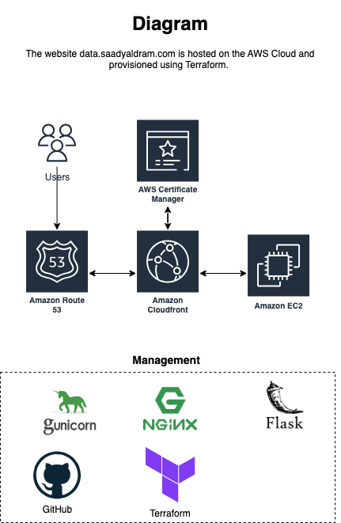

# RealEstate-vs-Demographics
This is a Python Flask web application that uses Gunicorn and Nginx as web servers, and is hosted on an EC2 instance with CloudFront distribution and Route 53 and AWS ACM for domain and SSL management. The application uses US census data to analyze patterns with real estate and demographics of America. This was my first attempt at data engineering where I get the data, clean it, and analyze and generate graphs for the audience to see.

## Architecture

## Data
The data compiled for this application came from the United States Census Bureau. The American Community Survey (ACS) releases new data every year in the form of estimates in a variety of tables. However given the pandamic, the 2020 year data was not published by ACS and thus 2020 data is not included in part of the analysis done in this applicaiton.

[American Community Survey](https://www.census.gov/programs-surveys/acs/data.html)

## Deployment
In order for the flask app to be production ready, Gunicorn was used to facilitate Flask application communication with Nginx. In general, Gunicorn is a Python WSGI HTTP server that can run multiple worker processes and handle concurrent requests. Nginx is a web server that can act as a reverse proxy and load balancer for the Gunicorn processes.

The deployment process involved the following steps:

- Creating a Python virtual environment and installing the required packages, such as Flask and Gunicorn, using pip.
- Creating a Flask app that serves a web page with Real Estate and Demographic data.
- Creating a WSGI entry point file that imports the app object from the Flask app and runs it with Gunicorn.
- Creating a systemd service file that enables Gunicorn to run as a daemon with three workers and a Unix socket.
- Installing Nginx and creating a configuration file that listens on port 80 and proxies requests to the Unix socket created by Gunicorn.
- Adjusting the firewall rules to allow Nginx ports and testing the Flask app by visiting the domain name or IP address of the EC2 instance.